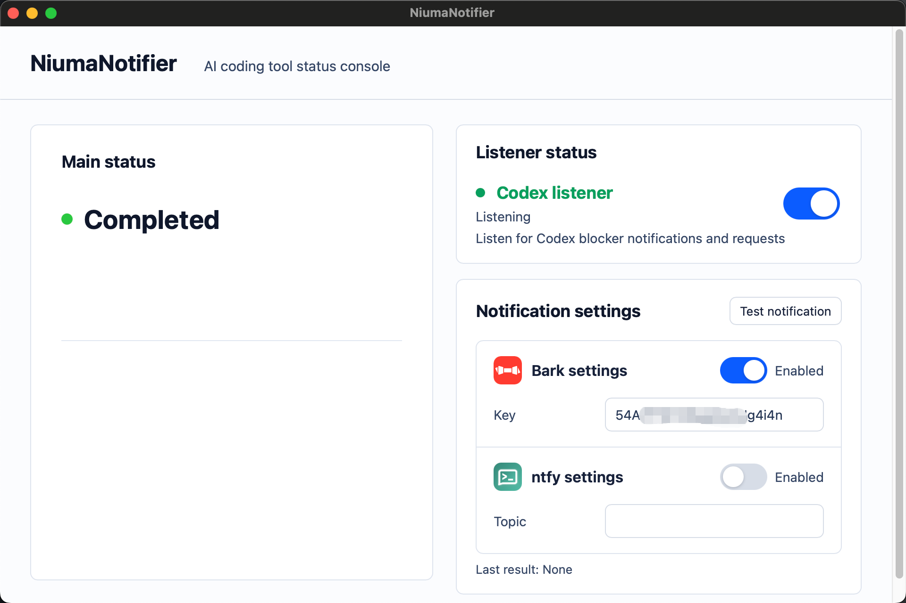
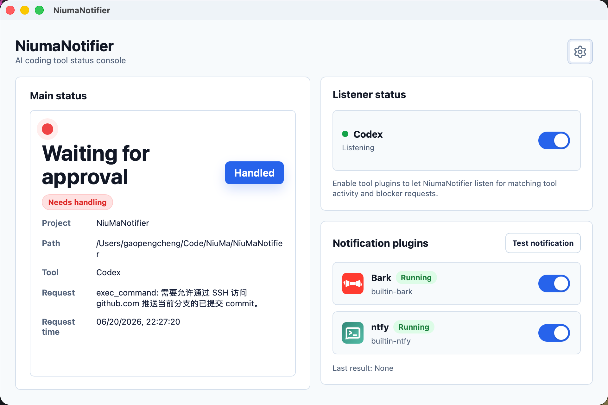
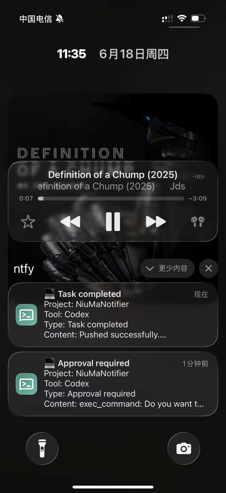

# NiuMaNotifier

 [中文文档](./README_zh.md)

NiuMaNotifier is a local desktop status notification tool for monitoring AI coding tools. It surfaces tool state through the desktop UI, menu bar, and notification channels when user attention is needed.

It solves a very specific problem: AI coding tools often stop at states such as "waiting for command approval", "waiting for input", "task failed", or "task completed", while the user may not be watching the terminal or editor. NiuMaNotifier collects these states into a unified local main state so you can more easily know when to come back and take action.

## Screenshots

### Main Console

<p align="left">
  
</p>

### Notification Settings

<p align="left">
  
</p>

### Mobile Push Notification

<p align="left">
  
</p>

The screenshots above show the macOS desktop main console, Bark / ntfy notification settings, and a push notification received on a mobile device.

## Current Status

Currently supported:

- macOS desktop app.
- Status monitoring for the macOS version of Codex.
- Codex session running, approval request, waiting for input, task completed, and task failed states.
- Bark and ntfy notification settings.

Notification channels:

- Bark: an iOS-oriented push notification service, suitable for quickly sending local AI tool status updates to Apple devices.
- ntfy: an open-source HTTP push notification service, suitable for self-hosted or public ntfy services for cross-platform notifications.

## Download or Build a macOS DMG

Download the DMG from GitHub Releases. Because this project does not yet configure Apple Developer certificates or notarization, macOS may report that the app is damaged and cannot be opened after installation. This happens because macOS adds a quarantine attribute to apps downloaded from the internet. After dragging `NiumaNotifier.app` to `/Applications`, remove the quarantine attribute locally:

```bash
sudo xattr -dr com.apple.quarantine /Applications/NiumaNotifier.app
```

This only tells your Mac to trust the downloaded app locally.

Alternatively, you can build a local `.dmg` manually:

```bash
npm ci
npm run tauri build -- --bundles dmg
```

After the build completes, the DMG is usually located at:

```text
target/release/bundle/dmg/
```

## Local API and SSE

NiuMaNotifier exposes a local SSE stream for external status panels, automation scripts, and notification agents. By default, the Local API listens on `http://127.0.0.1:27874`, and the main-state stream is available at `/api/v1/state/stream`.

See the integration guide for endpoint details, state fields, reset behavior, and examples:

- [English SSE integration guide](./docs/integration/sse-external-integration.md)

Planned support:

- Codex support on Windows / Linux.
- Claude Code support.
- Cursor and more AI coding tool adapters.
- Official installers, code signing, notarization, and automatic updates.

## Tech Stack

- Desktop: Tauri 2
- Frontend: TypeScript, Vite, native DOM/CSS
- Backend / core: Rust
- State storage: SQLite
- Notification channels: Bark, ntfy

## Quick Start

Required dependencies:

- Node.js and npm
- Rust stable toolchain
- macOS development dependencies required by Tauri 2

Install dependencies:

```bash
npm ci
```

Start the Tauri development app:

```bash
npm run tauri dev
```

## Testing

Frontend build and layout rendering tests:

```bash
npm run build
npm test
```

Rust workspace tests:

```bash
cargo test --workspace
```

## Repository Structure

```text
crates/niuma-core/        Core models, state aggregation, SQLite storage, tool protocol parsing
crates/niuma-api/         Local API and SSE
src/                      Desktop frontend code
src-tauri/                Tauri desktop app and background runtime
tests/                    Frontend layout and rendering tests
```

## Development Constraints

- Raw tool events must be converted into the unified `NiumaEvent`.
- Runtime in-process writes must go through `StateMutationService`.
- Do not bypass `SqliteStateStore` state transitions or directly modify the main state.
- Platform differences should live in `niuma_core::platform` first.
- New UI copy must include translations for all supported languages.
- Do not commit real tokens, local SQLite databases, private logs, build artifacts, or dependency directories.

## Local Data and Security Boundary

- App state and notification settings are stored in a local SQLite database.
- The first version of notification settings may store Bark device keys or ntfy tokens in plain text in SQLite.
- The `secret_ref` field is reserved for future migration to system secret storage.
- Do not commit real tokens, private logs, user session files, or local SQLite data to the repository.
- Third-party service marks under `public/assets/` are only used to display the corresponding notification channels. Trademark and redistribution requirements should be reviewed again before broader distribution.

## Roadmap

Near-term:

- Improve macOS Codex monitoring stability.
- Support macOS Claude Code.
- Support Windows Codex.
- Support Windows Claude Code.

Mid- to long-term:

- Support more AI coding tools.
- Support Windows and Linux.
- Support mobile clients and LAN pairing.
- Provide official release packages, signing, and automatic updates.

## License

This project is licensed under the MIT License. See [LICENSE](./LICENSE).
