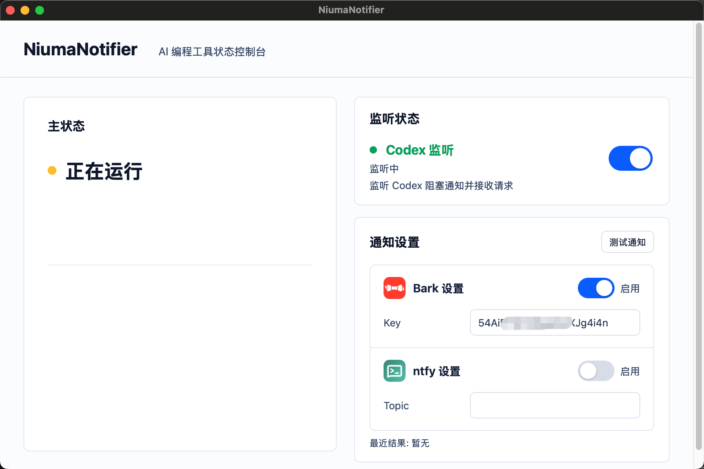
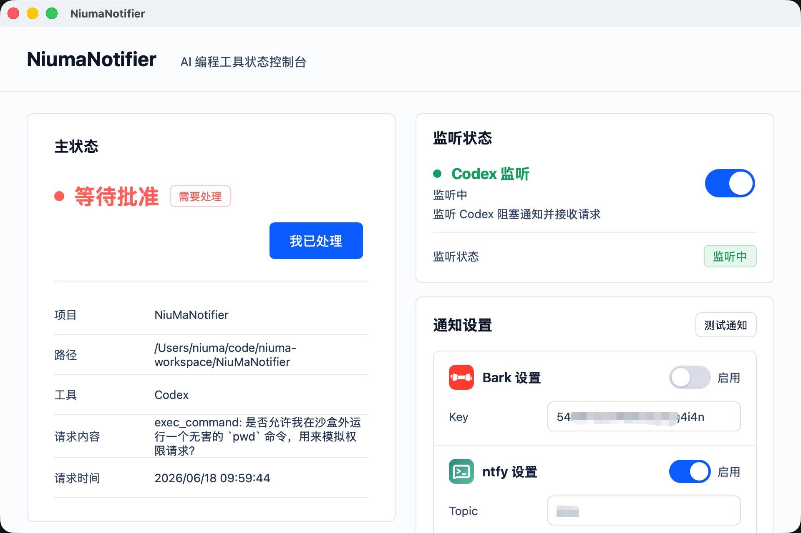
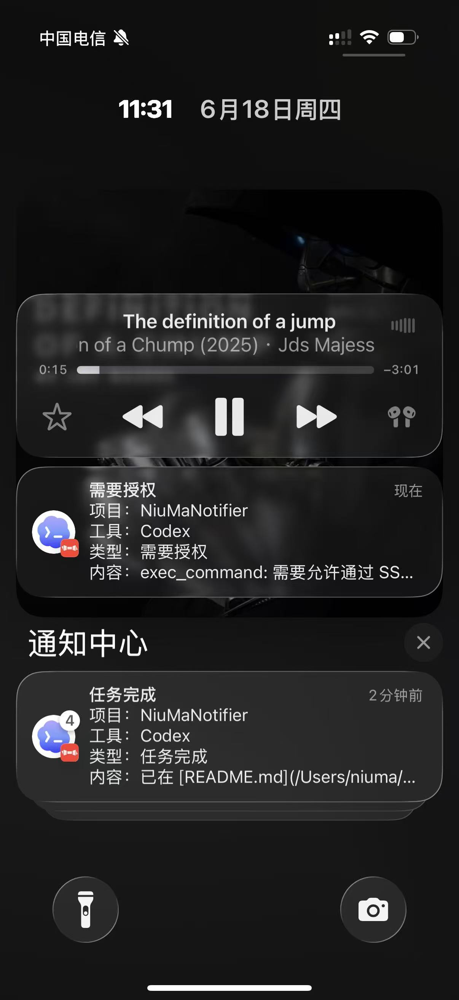

# NiuMaNotifier

NiuMaNotifier 是一个本地桌面状态通知工具，用来监听 AI 编程工具的运行状态，并在需要用户处理时通过桌面界面、状态栏和通知渠道提醒你。

它解决的是一个很具体的问题：AI 编程工具常常会停在“等待批准命令”“等待输入”“任务失败”或“任务完成”这些状态，但用户不一定正盯着终端或编辑器。NiuMaNotifier 会把这些状态统一收集成一个本机主状态，让你更容易知道什么时候需要回去处理。

## 界面截图

### 主控制台

<p align="left">
  
</p>

### 通知配置

<p align="left">
  
</p>

### 手机推送

<p align="left">
  
</p>

上图展示的是 macOS 桌面端主控制台、Bark / ntfy 通知配置，以及手机端收到的推送提醒。

## 当前状态

当前已支持：

- macOS 桌面端。
- macOS 版本 Codex 的状态监听，并已按内置插件方式接入后台运行时。
- Codex 会话运行、授权请求、等待输入、任务完成和任务失败状态。
- Bark 和 ntfy 通知配置。

通知渠道说明：

- Bark：面向 iOS 的推送服务，适合把本机 AI 工具状态快速推送到 Apple 设备。
- ntfy：开源的 HTTP 推送服务，适合自建或使用公共 ntfy 服务接收跨平台通知。

## 下载或打包 macOS DMG

从 GitHub Release 下载 DMG。由于当前项目还没有配置 Apple Developer 证书和公证，安装后 macOS 可能提示应用“已损坏，无法打开”。这是因为 macOS 会给从互联网下载的应用添加 quarantine 隔离属性。将 `NiumaNotifier.app` 拖到 `/Applications` 后，可以在本机执行下面的命令移除隔离属性：

```bash
sudo xattr -dr com.apple.quarantine /Applications/NiumaNotifier.app
```

这个命令只是让你的 Mac 本机信任下载的应用。

也可以选择手动在本机打包 `.dmg`：

```bash
npm ci
npm run tauri build -- --bundles dmg
```

打包完成后，DMG 通常位于：

```text
target/release/bundle/dmg/
```

## 本机 API 和 SSE

NiuMaNotifier 提供本机 SSE 状态流，方便外部状态面板、自动化脚本和通知代理接入。默认 Local API 地址为 `http://127.0.0.1:27874`，主状态流路径为 `/api/v1/stream`。

接口详情、状态字段、reset 行为和示例请参考：

- [中文 SSE 接入说明](./docs/integration/sse-external-integration_zh.md)
- [中文插件开发说明](./docs/integration/plugin-development_zh.md)

仓库内也提供了一个最小外部插件样例：

- [Demo Tool 插件样例](./examples/plugins/niuma-plugin-demo/README_zh.md)

后续支持：

- Windows / Linux 版本 Codex 支持。
- Claude Code 支持。
- Cursor 等更多 AI 工具适配。
- 正式安装包、代码签名、公证和自动更新。

## 技术栈

- 桌面端：Tauri 2
- 前端：TypeScript、Vite、原生 DOM/CSS
- 后端/核心：Rust
- 状态存储：SQLite
- 通知渠道：Bark、ntfy

## 快速开始

需要安装：

- Node.js 和 npm
- Rust stable toolchain
- Tauri 2 所需的 macOS 开发依赖

安装依赖：

```bash
npm ci
```

启动 Tauri 开发应用：

```bash
npm run tauri dev
```

## 测试

前端构建和布局渲染测试：

```bash
npm run build
npm test
```

Rust workspace 测试：

```bash
cargo test --workspace
```

## 仓库结构

```text
crates/niuma-core/        核心模型、状态聚合、SQLite 存储、工具协议解析
crates/niuma-api/         本机 Local API 和 SSE
src/                      桌面端前端代码
src-tauri/                Tauri 桌面端和后台运行时
tests/                    前端布局和渲染测试
```

## 开发约束

- 工具原始事件必须转换为统一的 `NiumaEvent`。
- 运行时进程内写入必须走 `StateMutationService`。
- 不绕过 `SqliteStateStore` 状态转移或直接修改主状态。
- 平台差异优先放入 `niuma_core::platform`。
- 新增界面文案必须同步补齐所有支持语言。
- 不提交真实 token、本机 SQLite、私有日志、构建产物或依赖目录。

## 本地数据和安全边界

- 应用状态和通知配置会保存在本机 SQLite 中。
- 当前第一版通知配置可能把 Bark device key 或 ntfy token 明文保存到 SQLite。
- `secret_ref` 字段已为后续系统密钥存储迁移预留。
- 不要把真实 token、私有日志、用户会话文件或本机 SQLite 数据提交到仓库。
- `public/assets/` 中的第三方服务标识仅用于展示对应通知渠道，正式扩大分发前需要再次确认商标和再分发要求。

## 路线图

近期方向：

- 完善 macOS Codex 内置插件监听稳定性。
- 开放外部工具插件安装和调试流程。
- 支持 macOS Claude Code。
- 支持 Windows Codex 。
- 支持 Windows Claude Code。

中长期方向：

- 支持更多 AI 编程工具。
- 支持 Windows 和 Linux。
- 支持手机端和局域网配对能力。
- 提供正式 release 包、签名和自动更新。

## 许可证

本项目使用 MIT License，见 [LICENSE](./LICENSE)。
